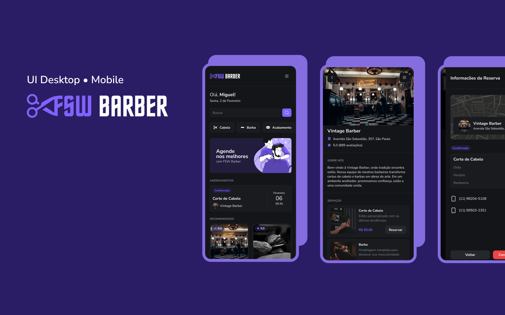

<h1 align="center">
  
</h1>

 

  

## ✨ Tecnologias

Esse projeto foi desenvolvido com as seguintes tecnologias:

- [Next.js](https://nextjs.org/)
- [Shadcn UI](https://ui.shadcn.com/)
- [Tailwind CSS](https://tailwindcss.com/)

## 💻 Projeto

O FSW Barber é um app de agendamente para barbearias!
